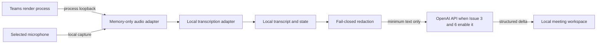

# ADR-0002: Teams会議はWindowsローカル音声adapterで取り込む

- Status: Accepted
- Source: Issue #5
- Reassessment: Issue #17 / ADR-0007はTeamsライブキャプションを第一候補にできるか検証中。decision gate完了までは本ADRが有効。

## Context

TechMap LiveはTeams会議中に低遅延で会話を構造化する一方、実会議データをpublic URL、LAN、GitHub、Sites、telemetryへ公開しない。アプリの状態管理、表示、保持、削除はローカルPCで行い、生音声は永続化しない。Issue #3と#6で許可・検証された場合に限り、redaction済みの必要最小限のtextをOpenAI APIへ送信できる。

Teams連携には、端末音声、Teams captions、Microsoft Graph transcript、calling／meeting bot、meeting side panelという異なる経路がある。それぞれリアルタイム性、話者情報、権限、管理者作業、外部hosting、費用、データ境界が異なる。

## Decision

初期の実会議入力は、Windowsローカルcompanion appに分離した2つのadapterで取り込む。

1. 利用者自身の発話は、明示的に選択したmicrophoneから取得する。
2. Teamsから再生される相手側音声は、Windows application loopbackでTeamsの対象process treeに限定して取得する。

application loopbackには`PROCESS_LOOPBACK_MODE_INCLUDE_TARGET_PROCESS_TREE`を使い、system-wide loopbackへ自動的に拡張しない。Windows build 20348未満はprocess loopback非対応として扱う。Windows clientの配布対象はWindows 11 build 22000以降とし、marketing versionではなくbuild numberとAPI capabilityを起動時に検出する。

音声frameはmemory内だけでlocal transcription adapterへ渡し、録音file、一時file、診断log、crash reportへ書き出さない。文字起こし、分析状態、利用者が明示したexportはGit working tree外のローカルapp dataへ保存できる。OpenAI API送信は本ADRの許可対象ではなく、#3と#6のredaction、`store: false`、data control境界をそのまま継承する。

実会議データを扱えるruntimeはpublic URLを作らない。embedded desktop shellを優先し、local web serverが必要なmodeは`127.0.0.1`または`::1`だけへbindする。ChatGPT Sitesは合成fixtureによるUI review専用とする。

capture adapterは`active`、`remote-audio-undetected`、`degraded-microphone-only`、`stopped`をworkspaceへ通知する。開始時に対象processまたはaudio streamを確立できなければ、理由付きの`stopped`を表示し、利用者が明示的にmicrophone-onlyへ切り替えるまで分析を開始しない。会議中にprocess終了、audio client invalidation、device切替を検出した場合は直ちに`degraded-microphone-only`へ遷移し、相手側発話を取得できないことを常時表示する。target streamがactiveのままdigital silenceが15秒続く場合は`remote-audio-undetected`を表示するが、会話中の沈黙と区別できないため自動停止はしない。processまたはdeviceが復帰しても自動的に`active`へ戻さず、利用者が再接続を選び、streamの再確立に成功した場合だけ`active`へ遷移する。

## Data flow

## Options

| 方式 | リアルタイム／話者 | 権限・管理者作業 | 同意・platform制約 | 実装・運用費 | 判断 |
|---|---|---|---|---|---|
| microphone only | 可。利用者側のみ確実 | OS microphone許可 | アプリ側の同意確認 | 小。ローカルcompute | process loopback非対応時の縮退 |
| Teams process loopback + microphone | 可。利用者／相手側groupまで | OS許可。Teams tenant変更なし | アプリ側の同意確認。対象process以外を取得しない | 中。Windows native adapterとローカルcompute | MVP採用 |
| Teams live captions | 表示はリアルタイム。Teams表示に依存 | Teams policyに依存 | 取得用の公開app APIを確認できない | 非公式取得は高い保守・規約risk | 不採用。DOM／screen scrapingもしない |
| Microsoft Graph transcript | 会議終了後。speakerはtenant設定次第 | Graph permission、transcript access、speaker attribution設定 | tenant policy、meeting固有RSCまたは組織wide permission | 中。metered APIと通知処理 | 将来の事後照合候補 |
| application-hosted media bot | 可。botが得るmedia／meeting contextに依存 | Entra app、media permission、admin consent | recording status通知とTeams platform要件 | 大。Azure Windows Server、public IP／port、継続更新 | ローカル・非公開境界に反するため不採用 |
| Teams meeting side panel | UIは会議中。media取得手段ではない | Teams app登録・配布 | HTTPS hostingとTeams CSP | 中。hostingと配布運用 | 将来UI候補。MVPでは不採用 |

## Consent boundary

Teamsの録音・transcription同意policyが有効かどうかに依存せず、TechMap Liveは実入力開始前に利用者へ参加者同意の確認を要求し、capture中であることを常時表示する。Teams側の同意状態を取得できないmodeでは、アプリが同意済みと推測してはならない。

文字起こしと分析状態の保持期間、明示export、削除は#6のlocal data lifecycleに従う。tenantをまたぐGraphまたはbot accessは許可済みと推測せず、対象tenantの管理者承認を別Issueで確認する。

## Assumptions and required confirmation

- Microsoftのapplication loopback APIはprocess treeを限定できるが、利用中のTeams buildでrender processが対象treeへ含まれることは実機で確認する必要がある。
- Teams live captionsについて、調査したMicrosoft公式developer documentationから外部取得用のsupported APIを確認できなかった。不採用判断はこの公開仕様に基づく推論である。
- Graph transcriptを将来有効化する場合は、tenant管理者がGraph transcript access、speaker attribution、permission consent、meteringを確認する。
- Teamsのexplicit consent policyが無効でも、TechMap Live独自の同意確認と常時indicatorを省略しない。

## Consequences

- Windows固有のnative audio adapterとTeams process discoveryが必要になる。UI、domain model、transcription、analysisからIPC境界で分離する。
- process treeと実際のaudio render processが一致する保証はないため、#2は対応Windows build、対象process、silence、process restartを検証するcapability spikeから開始する。
- 相手側の複数参加者はmixされたstreamになるため、MVPは個別のspeaker identityを断定しない。Graph transcriptを許可できる場合は、会議後のspeaker attributionと発話IDを照合するadapterを追加できる。
- Graph transcriptは会議後の補正には使えるが、live mapの入力には使わない。
- Azure media botまたはTeams side panelへ移行する場合は、local-only／public ingress禁止というproduct boundaryの変更、tenant管理者の承認、新しいADRを必要とする。

## Verification required by implementations

- 対応Windows buildとprocess-loopback capabilityを開始前に検出する。
- Teams以外のprocess音声を取得しないことを合成audioで検証する。
- 対象process未検出、stream確立失敗、15秒のdigital silence、process restart、device切替で規定のcapture状態へ遷移することを検証する。
- 生音声がdisk、log、crash artifactへ残らないことを検証する。
- 利用者操作前にcaptureを開始せず、同意確認とcapture indicatorを表示する。
- 実会議を扱えるすべてのmodeでpublic／LAN ingressがなく、runtime egressが許可先だけであることを検証する。

## Official references

- [Application loopback audio capture](https://learn.microsoft.com/en-us/samples/microsoft/windows-classic-samples/applicationloopbackaudio-sample/)
- [Get meeting transcripts and recordings using Graph APIs](https://learn.microsoft.com/en-us/microsoftteams/platform/graph-api/meeting-transcripts/overview-transcripts)
- [Manage transcript API access for Teams meetings](https://learn.microsoft.com/en-us/microsoftteams/meeting-transcript-api-access)
- [Requirements for application-hosted media bots](https://learn.microsoft.com/en-us/microsoftteams/platform/bots/calls-and-meetings/requirements-considerations-application-hosted-media-bots)
- [Register calls and meetings bots](https://learn.microsoft.com/en-us/microsoftteams/platform/bots/calls-and-meetings/registering-calling-bot)
- [Requirements for Teams tabs](https://learn.microsoft.com/en-us/microsoftteams/platform/tabs/how-to/tab-requirements)
- [Manage participant agreement for recording and transcription](https://learn.microsoft.com/en-us/microsoftteams/participant-agreement-recording-transcription)
