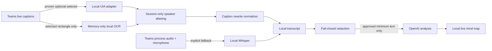

# ADR-0007: Teamsライブキャプションを第一候補の文字入力とする

- Status: Proposed（Issue #17の実機capability確認後にAcceptedまたはRejectedへ変更）
- Source: Issue #17
- Reassesses: ADR-0002, ADR-0003

## Context

ADR-0002とADR-0003は、利用者のmicrophoneとTeams process loopbackをローカルwhisper.cppへ入力する方式をMVPに採用した。この方式はTeams tenant変更や外部音声送信を必要としない一方、相手側の複数話者を`remote-group`としてしか扱えず、軽量modelによる日本語認識品質と端末負荷が試用品質の制約になる。

Teamsのライブキャプションは会議中に文字と発話者表示を生成する。Microsoftの利用者向け仕様では、参加者は発話者としての識別を無効化でき、ライブキャプションは会議後にTeamsへ保存されない。公式developer documentationから外部アプリがライブキャプションを読むsupported APIは確認できないため、利用者が選択した字幕矩形だけのlocal OCRと、Windows UI Automationで字幕要素を読む経路を検証する。

UI AutomationとOCRはいずれもTeamsの公開連携契約ではない。Teams UI、accessibility tree、表示倍率、theme、window visibility、caption languageの変更で利用不能になり得る。したがって、利用可能性を推測せず、runtime capabilityと利用者選択を毎session確認する。

## Proposed decision

Issue #17のdecision gateを満たした環境では、文字入力を次の優先順とする。

1. 利用者が明示選択したTeams字幕矩形だけをmemory内でlocal OCRする。
2. UI Automationが5秒以内に応答し、字幕以外を除外する安定selectorを実機で証明できたTeams buildでは、画像化しない最適化としてUIAを選択できる。
3. 字幕が無効、非表示、不安定、またはconfidence不足の場合、利用者が明示的に選択したときだけADR-0002/0003のprocess-scoped audio＋local Whisperへ切り替える。

字幕経路を`TranscriptSource` adapterとして音声文字起こしから分離する。下流のtranscript、分析、mind mapは取得経路に依存しない。UIAとOCRは同時に実行せず、利用者が選択したsourceだけを動かす。

2026-08-28に対象Windows PCでcontent-free `probe`を実行したところ、Teams UIA root取得は5秒以内に応答せず`probe-timeout`となった。本文、要素名、window title、PIDは取得・出力していない。この結果はすべてのTeams buildでUIAが不可能な証明ではないが、対象MVP環境でUIAを既定経路にする仮説を支持しないため、OCRを先頭へ変更する。

従来の`Windows.Media.Ocr`はMicrosoft公式仕様上、desktop appではpackage identityを必要とする。また結果はtextと位置を提供するがconfidence propertyを提供しない。unpackaged MVPで利用する場合は、MSIX化してWindows OCRを使う案と、固定version/hashのlocal Tesseractをmemory pipeで使う案を別Issueで比較する。confidenceを得られないengineは、同一文字列を連続2回以上観測した場合だけ発話候補として受け入れる。

発話者の画面表示名はnative adapter内のsession-only tableで`self`または`speaker-1`から`speaker-999`へ変換する。raw display nameはbrowser、local persistence、log、OpenAI requestへ渡さない。発話者が識別を無効化した場合は`anonymous`、取得不能な場合は`unknown`とし、個人を推定しない。

## Decision gate

`Accepted`へ変更するには、本人だけの明示的なテスト会議または合成Teams UIで次を確認する。

- 選択対象が`ms-teams.exe`に属することをprocess imageで検証できる。
- UIAが字幕のspeaker/text更新を取得でき、他のchat、通知、参加者一覧を読み取らないselectorを確立できる。
- partial rewrite、行の再利用、行消失、同一発話の重複をversioned eventへ決定的に正規化できる。
- 字幕OFF、Teams最小化、対象消失、UI変更時に`degraded-caption-missing`へfail closedする。
- 取得した画面画像、raw display name、実字幕がdisk、log、Git、CI artifact、networkへ出ない。
- OCRの対象矩形が利用者選択範囲を越えず、confidence不足または連続安定性不足を発話として確定しない。

UIA selectorの限定性を証明できない場合は、UIAを不採用としてOCR gateだけを評価する。OCR矩形の限定性または日本語品質を証明できない場合は、ADR-0002/0003をMVP標準経路として維持する。

## Data flow

## Privacy and consent

- `probe`はwindow title、PID、Automation Name/Value/Textを出力しない。
- sensitive propertyを読むprobeは、同意確認後に利用者が指したTeams要素だけを対象とし、文字列自体やhashを出力しない。
- OCR bitmapはbounded memoryだけに保持し、file、clipboard、telemetry、crash attachmentへ渡さない。
- subtitle textは#6の保持・全削除・明示export境界へ入る。保存opt-inがないsessionでは終了時に破棄する。
- LLM送信許可があっても、raw participant identityとOCR画像は送信対象外とする。送る文字は既存redactionと範囲確認を通す。
- Teams captionが表示されていることを参加者同意の証拠とみなさない。アプリ独自の確認と常時indicatorを維持する。

## Consequences

- 話者表示とTeams側の認識結果を利用できる可能性があり、local ASRの端末負荷を避けられる。
- UIA/OCRは非公式UI依存なので、音声fallbackを削除できない。
- caption sourceの品質と遅延はIssue #7で音声sourceと同じ合成eval contractにより比較する。
- live transcription paneは保存・tenant policy境界がライブキャプションと異なるため、本ADRでは自動開始・取得しない。

## Official references

- [Use live captions in Microsoft Teams meetings](https://support.microsoft.com/en-US/teams/meetings/use-live-captions-in-microsoft-teams-meetings)
- [Hide your identity in meeting captions and transcripts](https://support.microsoft.com/en-us/teams/meetings-events/hide-your-identity-in-meeting-captions-and-transcripts-in-microsoft-teams)
- [Start, stop, and download live transcription](https://support.microsoft.com/en-US/teams/meetings/start-stop-and-download-live-transcripts-in-microsoft-teams-meetings)
- [Manage meeting transcript API access](https://learn.microsoft.com/en-us/microsoftteams/meeting-transcript-api-access)
- [Windows.Media.Ocr namespace](https://learn.microsoft.com/en-us/uwp/api/windows.media.ocr)
- [OcrEngine class](https://learn.microsoft.com/en-us/uwp/api/windows.media.ocr.ocrengine)
